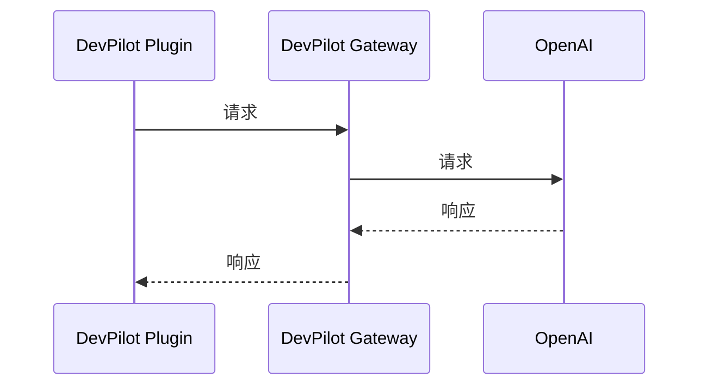

# DevPilot Gateway使用手册

[中文](README_Gateway.md) ｜ [English](README_Gateway_EN.md)

## 技术架构流程图

DevPilot插件与Gateway之间的交互流程如下：

## 下载插件代码

### DevPilot IntelliJ IDEA

[DevPilot IntelliJ IDEA](https://github.com/openpilot-hub/devpilot-intellij)

### DevPilot Visual Studio Code

[DevPilot Visual Studio Code](https://github.com/openpilot-hub/devpilot-vscode)

## 设置 LLM API Key

[BUILD_GATEWAY.md](https://github.com/openpilot-hub/devpilot-gateway/blob/main/BUILD_GATEWAY_ZH.md)

## 贡献

更多信息请查看[CONTRIBUTING_ZH.md](https://github.com/openpilot-hub/devpilot-gateway/blob/main/CONTRIBUTING_ZH.md)

