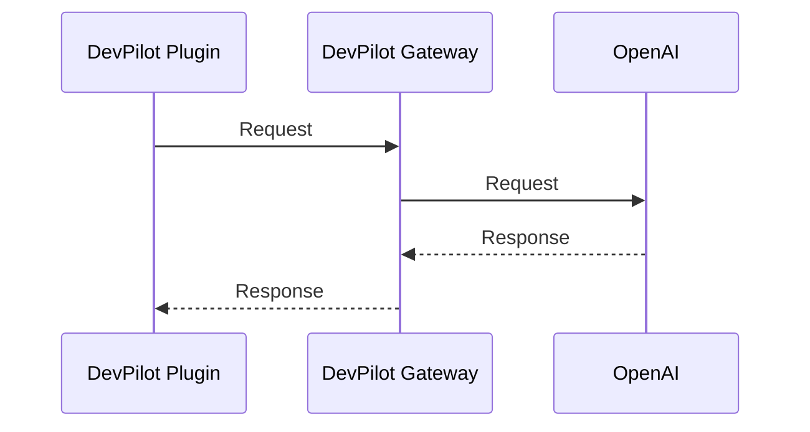

# DevPilot Gateway User Manual

[中文](README_Gateway.md) ｜ [English](README_Gateway_EN.md)

## Technical Architecture Process Diagram

The interaction process between the DevPilot plugin and Gateway is as follows:

## Download Plugin Code

### DevPilot IntelliJ IDEA

[DevPilot IntelliJ IDEA](https://github.com/openpilot-hub/devpilot-intellij)

### DevPilot Visual Studio Code

[DevPilot Visual Studio Code](https://github.com/openpilot-hub/devpilot-vscode)

## Set LLM API Key

[BUILD_GATEWAY.md](https://github.com/openpilot-hub/devpilot-gateway/blob/main/BUILD_GATEWAY.md)

## Contributing

See [CONTRIBUTING.md](https://github.com/openpilot-hub/devpilot-gateway/blob/main/CONTRIBUTING.md) for more information.