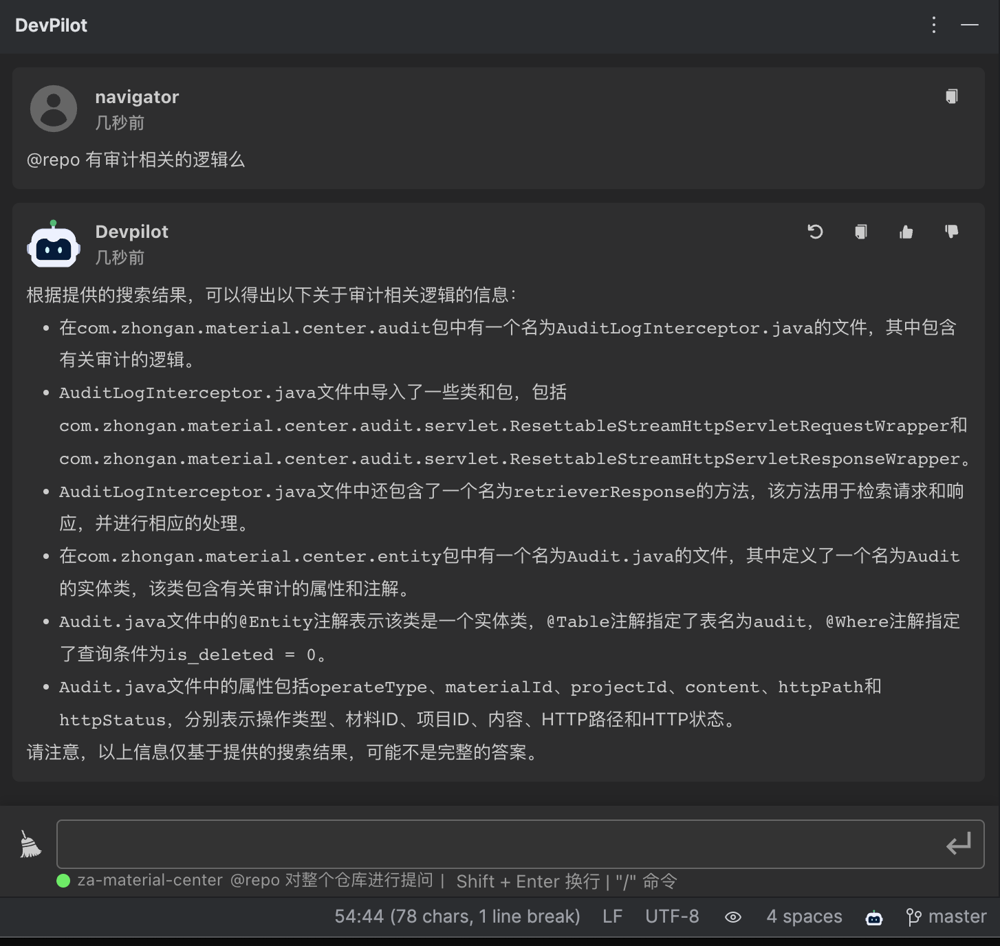
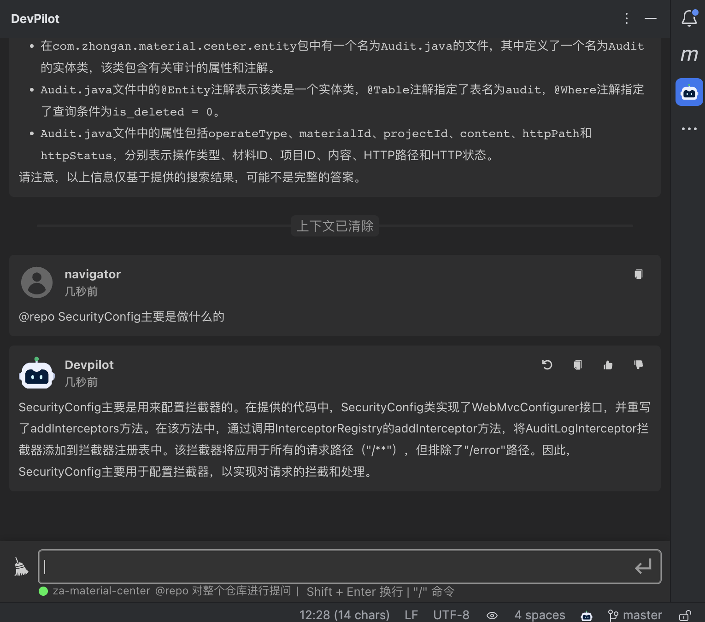
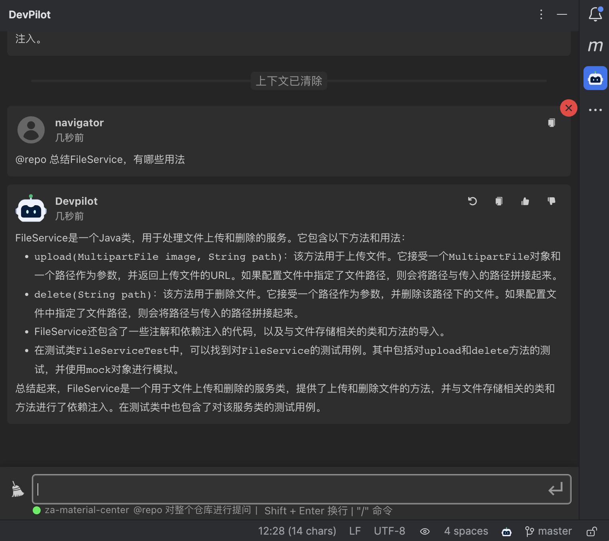

# 工程级代码感知RAG功能使用手册

[中文](README_RAG.md) ｜ [English](README_RAG_EN.md)

## 外部用户如何使用私域知识？

### 目前暂未支持外部用户使用私域知识

我们很快会支持外部用户使用私域知识，敬请期待！

## 工程向量化检索增强生成可以做什么？

### 快速开始

输入框下方的仓库标签亮时表明该仓库已向量化，可点击开始体验RAG带来的功能体验

### 功能场景询问

通过@repo 可以询问仓库有哪些特殊的功能场景

### 类分析

通过@repo 可以询问特定的某一个类是做什么的

### 引用关系

通过@repo 可以询问特定的某一个类的引用关系是什么样的

### 文件总结

通过@repo 可以对特定的一个类要求做总结

### 简单demo

通过@repo 写一个简单的业务逻辑

