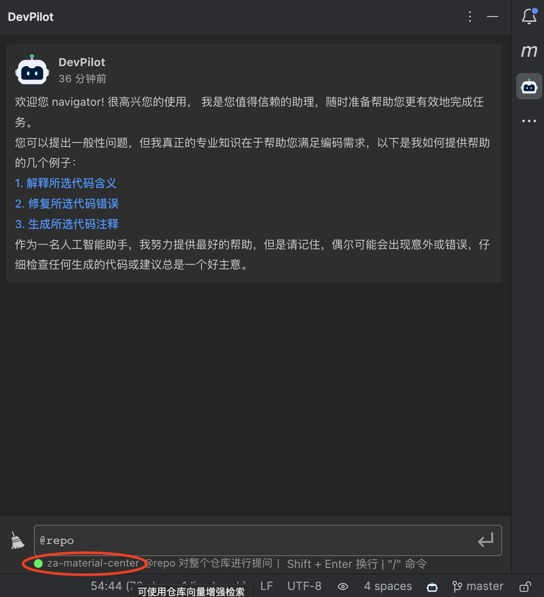
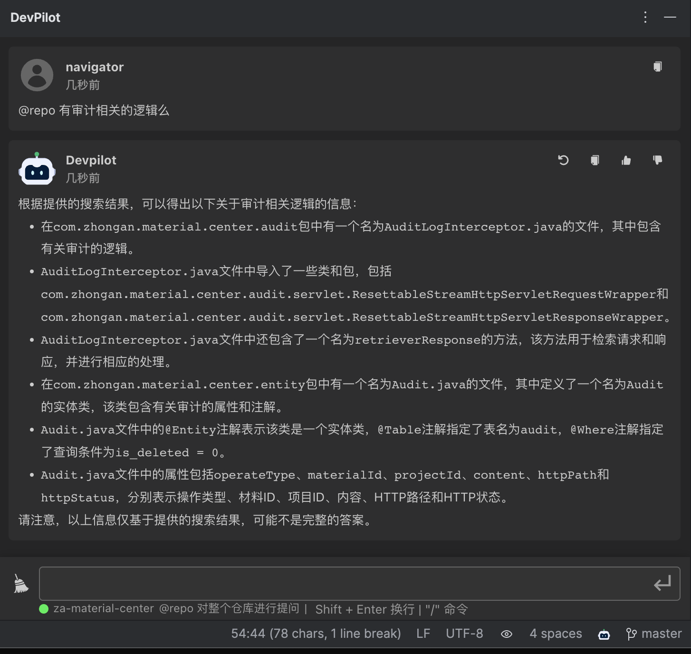
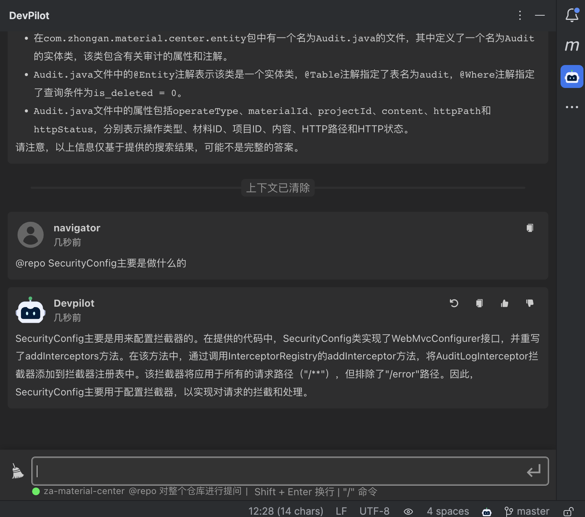
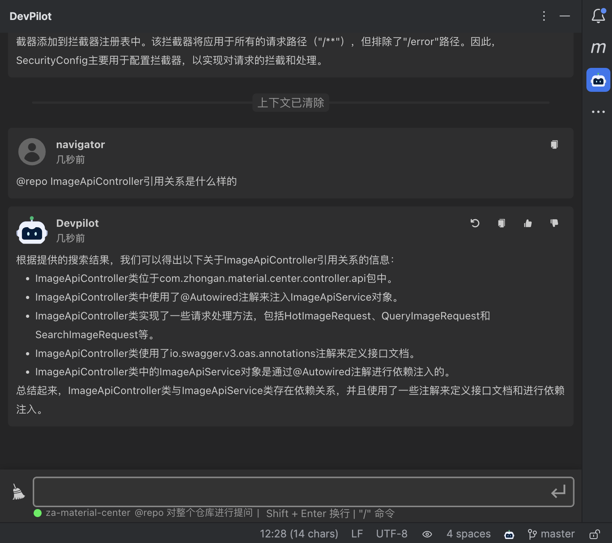
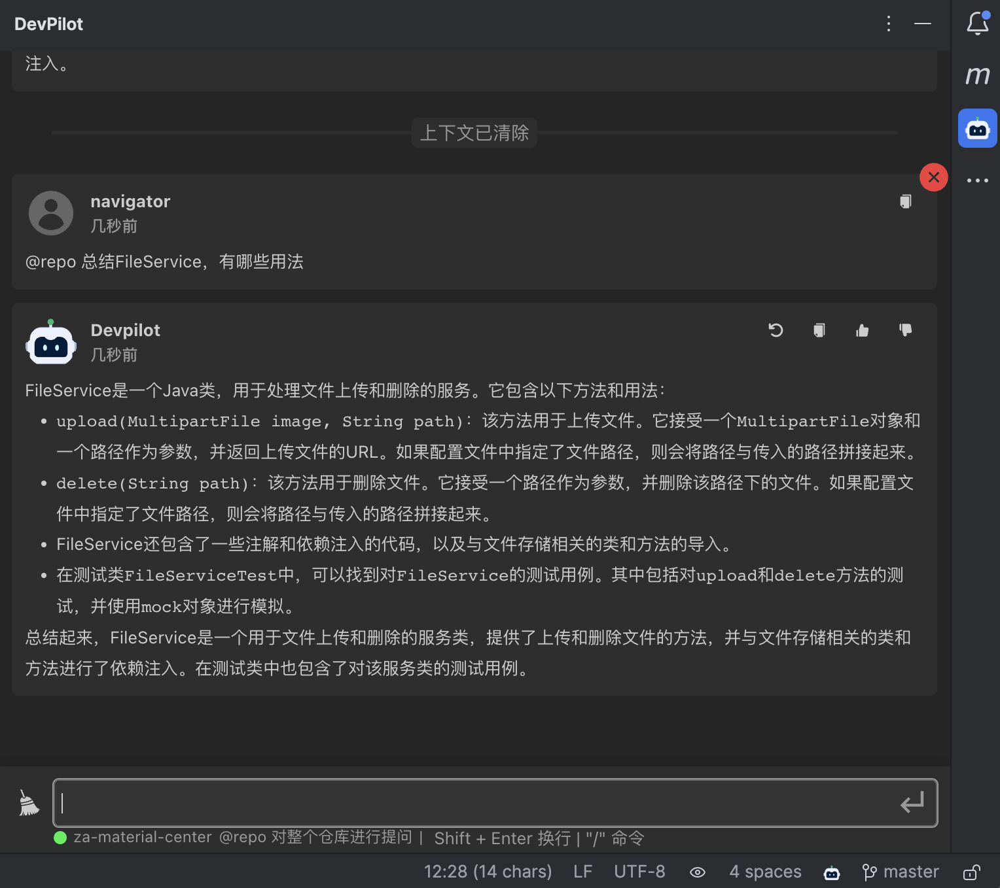
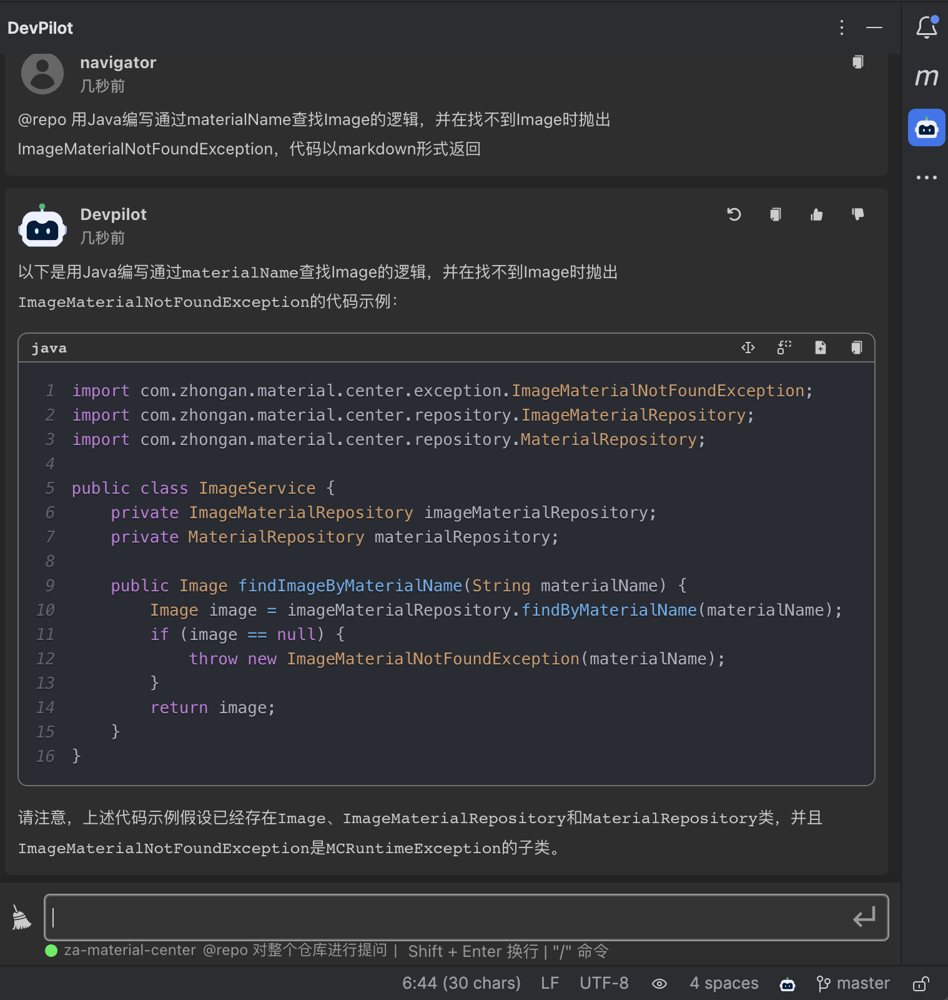

# RAG Manual

[中文](README_RAG.md) ｜ [English](README_RAG_EN.md)

## How to use private domain knowledge?

### Currently not supported for external users to use private domain knowledge

We will soon support external users to use private domain knowledge, so stay tuned!

## What can do?

### Quick Start

When the warehouse label below the input box lights up, it indicates that the warehouse has been embedded. You can click to start experiencing the functional experience brought by RAG

### Function Scene Query

Using @repo, you can ask what special functional scenarios the warehouse has

### Explain Class File

What does a particular class do with @repo

### Class reference relationship

What is the reference relationship for a particular class that can be asked by @repo

### Class File Summary

A specific class requirement can be summarized by @repo

### Demo

Write a simple business logic via @repo

